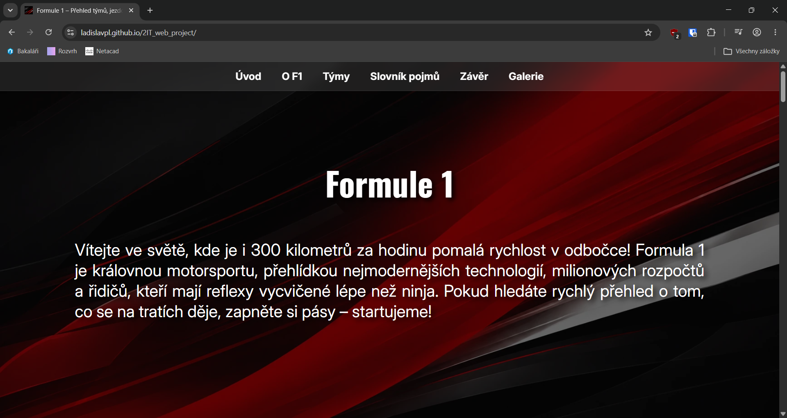
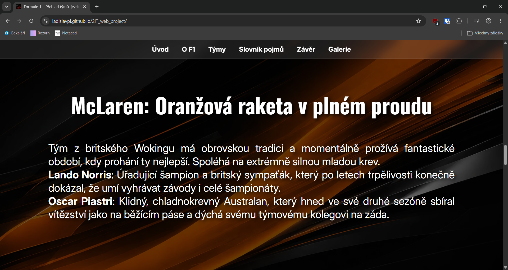
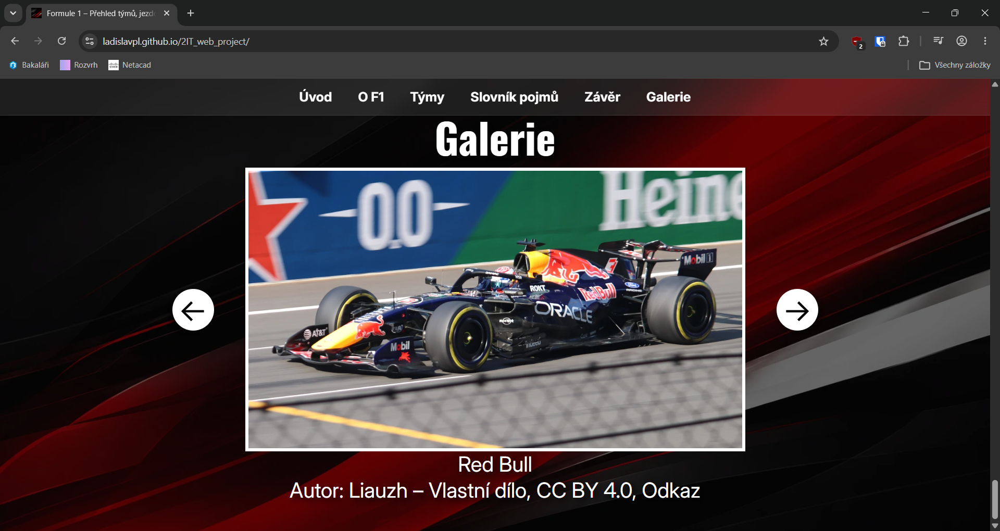
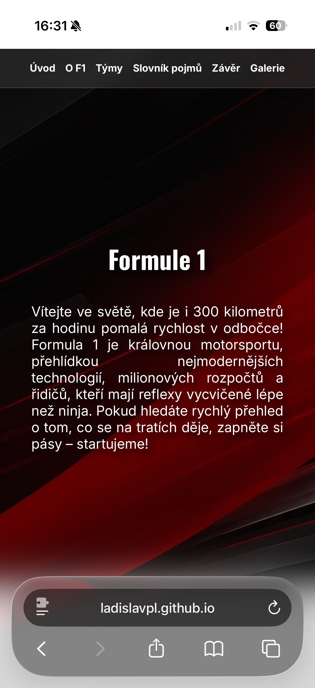
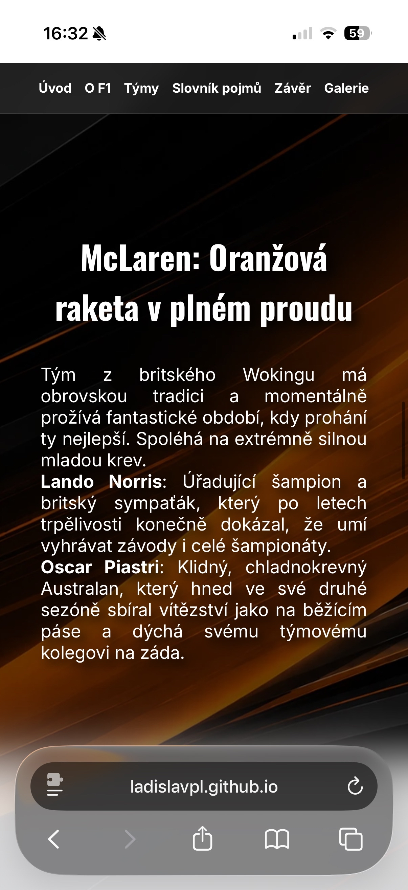
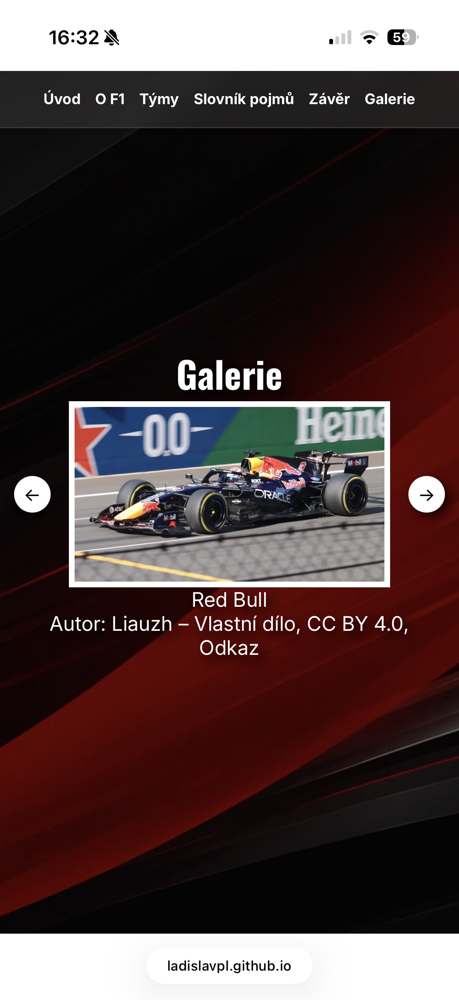

# Webová prezentace o Formuli 1
## Úvod
Téma tohoto webu je shrnutí Formule 1, obsahuje základní informace a popisuje nejzajímavější týmy a řidiče. Také obsahuje galerii s obrázky aut jednotlivých týmů a nějaké zajímavé pojmy. Všechny informace jsou aktuální pro rok 2026.  
Stránka je hostována na GitHub Pages, dá se k ní dostat na [tomto](https://ladislavpl.github.io/2IT_web_project) odkaze.
## Použité technologie
Webová stránka používá čisté HTML5, CSS3 a Vannila JavaScript (ES6+) a pro její tvorbu bylo použito IDE Visual Studio Code verze 1.123.0
## Adresářová struktura
V kořenovém adresáři webu jsou uloženy HTML a CSS soubory a obecné soubory (robots.txt, sitemap.xml...). Všechny použité fonty jsou uloženy ve složce fonts, všechny obrázky jsou uloženy ve složce img a jsou rozřazeny do podadresářů dle kategorií (např. obrázky aut do složky cars), všechny JavaScript soubory jsou uloženy ve složce js.
## Technický rozbor
### Výkon (Performance)
Všechny obrázky jsou ve formátu .webp a pokud je potřeba, jsou downscalované tak, aby nebyli ve zbytečně vysokém rozlišení.  
Všechny fonty použité ve stránce jsou uloženy ve složce fonts a nejsou stahovány ze serveru třetí strany. Jako formát je použit .woff2, aby se optimalizovala velikost souboru a zrychlilo se načítání stránky. Import fontů je poté definován v CSS.
```css
@font-face {
    font-family: "Inter";
    src: url("./fonts/Inter.woff2") format("woff2");
    font-weight: 100 900;
    font-style: normal;
    font-display: swap;
}
```
*Příklad pro font Inter*
  
Ve stejných složkách jako neminifikované soubory JS a CSS jsou uloženy i jejich minifikované verze. Tyto verze jsou používané samotnou webovou stránkou, ty neminifikované jsou zde pouze pro případ, kdyby někdo kód četl.
### SEO
Search Engine Optimalization je zde řešena použitím meta tagů (description, keywords a author) a soubory sitemap.xml a robots.txt v kořenovém adresáři.
```html
<meta name="description" content="Přehled světa Formule 1 – od nejlepších týmů jako Ferrari, McLaren a Red Bull, přes jejich piloty, až po vysvětlení základních pojmů jako pit stop a safety car.">
<meta name="keywords" content="F1, Formula, Formule">
<meta name="author" content="Ladislav Jaromír Pleštil">
```
*Meta tagy použité v samotné webové stránce*
```xml
<?xml version="1.0" encoding="UTF-8"?>
<urlset xmlns="http://www.sitemaps.org/schemas/sitemap/0.9">
  <url>
    <loc>https://ladislavpl.github.io/2IT_web_project/</loc>
    <lastmod>2026-06-07</lastmod>
    <changefreq>monthly</changefreq>
    <priority>1.0</priority>
  </url>
</urlset>
```
*Soubor sitemap.xml*
```
User-agent: *
Allow: /

Sitemap: https://ladislavpl.github.io/2IT_web_project/sitemap.xml
```
*Soubor robots.txt*

### Přistupnost (Accessibility)
Kontrast barev je řešen pomocí ztmavení pozadí přes selektor section::before, stíny za textem a bílou barvou textu, což zajišťuje dobrou čitelnost.
```css
section::before {
    content: '';
    position: absolute;
    inset: 0;
    background: rgba(0, 0, 0, 0.45);
    z-index: 0;
}
```
*Úryvek kódu který zajišťuje ztmavení pozadí*

V HTML jsou použity ARIA labely k označení sekcí stránky a je použit aria-live="polite" pro popisek obrázku v galerii, aby se zajistila dobrá kompatibilita pro čtečky obrazovky.
```html
<p id="caption" aria-live="polite"></p>
<main aria-label="Obsah stránky">
```
*Příklady použití ARIA atributů v mém kódu*

Ovladatelnost klávesnici je pro tuto stránku řešena v JavaScriptu pro galerii, aby se dali obrázky přepínat pomocí šipek doleva a doprava. Mezi jednotlivými sekcemi stránky se dá také přepínat šípkami nahoru a dolů.
```js
document.addEventListener('keydown', e => {
  if (e.key === 'ArrowLeft') prev();
  if (e.key === 'ArrowRight') next();
});
```
*Řešení přepínání mezi obrázky v galerii*

### Sociální sítě
Do webu jsou implementovány Open Graph protokoly tak, aby byla zajištěna kompatibilita se sociálními sítěmi.
```html
<meta property="og:title" content="Formula 1">
<meta property="og:type" content="website">
<meta property="og:url" content="https://ladislavpl.github.io2IT_web_project/">
<meta property="og:image" content="https://ladislavpl.githubio/2IT_web_project/img/favicons/web-app-manifest-512x512.png">
```
*Nejdůležitější Open Graph meta tagy*

Na webu jsou také použity meta tagy pro X Cards, aby byla zajištěna kompatibilita se sociální sítí X (Twitter).
```html
<meta name="twitter:card" content="summary_large_image">
<meta name="twitter:title" content="Formula 1">
<meta name="twitter:description" content="Fanouškovskástránka o Formuli 1">
<meta name="twitter:image" content="https://ladislavpl.githubio/2IT_web_project/img/backgrounds/main.png">
<meta name="twitter:site" content="@_ladislavv_p_">
```
*X Cards meta tagy*

### UI/UX
Responzivní design je řešen pomocí pravidla @media, aby stránka vypadala co nejlépe i na mobilním telefonu.
```css
@media (max-width: 768px) {
    header nav {
        gap: 1em;
        font-size: 0.80em;
    }
}
```
*Úprava odkazů v headeru pro mobily*

Intuitivní navigace je řešena pomocí navigačního headeru, přes který se dá proklikávat do jednotlivých sekcí stránky.
```html
<nav aria-label="Hlavní navigace">
    <a href="#section1"><b>Úvod</b></a>
    <a href="#section2"><b>O F1</b></a>
    <a href="#section3"><b>Týmy</b></a>
    <a href="#section9"><b>Slovník pojmů</b></a>
    <a href="#section10"><b>Závěr</b></a>
    <a href="#section11"><b>Galerie</b></a>
</nav>
```
*Navigační header použitý ve webu*

### AI Integrace
AI byla použita pro vygenerování textu, pozadí, kontrolu validity kódu a kontrolu splnění oblastí optimalizace.
```
udělej audit a zkontroluj validnost celého kódu a zkontroluj požadavky uvedené výše.
```
*Příklad promptu pro kontrolu kódu*

## AI Deník
Pro generaci textu použitého ve stránce jsem použil následující prompt:
```
Vygeneruj mi text na použití do webové stránky o F1. Text by měl být rozdělen do kapitol a měl by hravě a zábavně popisovat základní informace o F1 a informace o týmech a jejich řidičích. Nepiš text již s html tags, použíj plain text.
```
AI vytvořila slovník pojmů, původně tam byli 3 pojmy, ale jeden platil do roku 2025, proto jsem ho neuvedl. Do závorek na nadpis pro slovník pojmů AI použila tak "hravou" frázi, že jsem jí raději do finální stránky nedal, viz odkaz [zde](https://gemini.google.com/share/8570194be86f).  
AI byla také použita pro generaci pozadí, které byli použity za jednotlivými sekcemi. Jinak byla AI používána pouze jako asistent.

## Instalace a spuštění
Repozitář naklonujte do složky a tu složku otevřete ve VS Code. Klikněte na index.html a spusťte stránku přes rozšíření Live Server.

## Galerie
### Desktop



### Mobile


